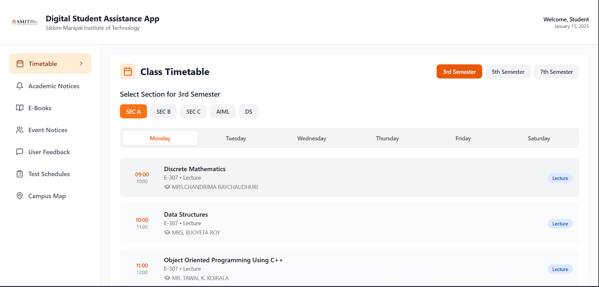
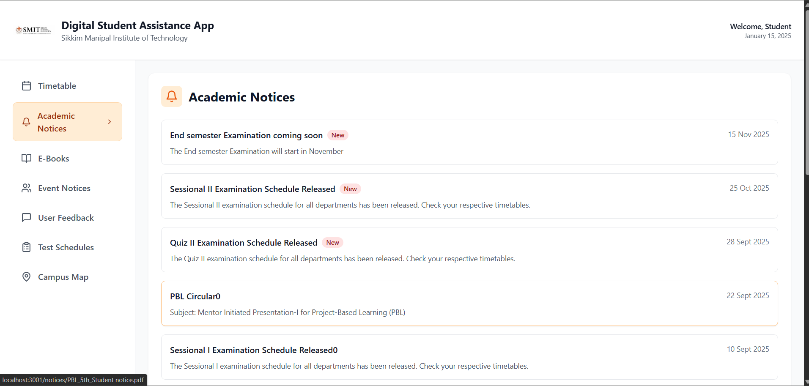
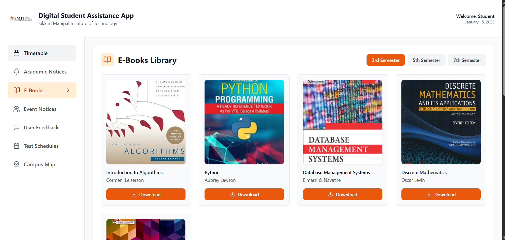
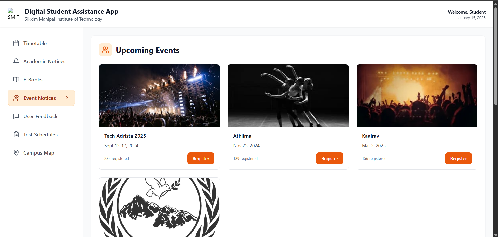

# Student Assistance Portal

## 📌 Description

A full-stack academic management portal designed specifically for students and teachers. The application centralizes essential campus resources—ranging from live timetables to digital library access—into a single, responsive dashboard to improve student organization and productivity.

## 🚀 Features

* Dynamic Timetable System: Interactive schedules for 3rd, 5th, and 7th semesters with real-time data fetching from a Node.js backend.
* Resource Hub: Integrated access to Academic Notices, Event Updates, E-Books, and Test Schedules.
* Full-Stack Integration: Uses a RESTful API architecture with Vite proxying to ensure seamless communication between the React frontend and Express server.
* Responsive UI: A modern, mobile-first design built with Tailwind CSS for high readability on any device.
* Campus Utilities: Includes an integrated Campus Map and a User Feedback module for institutional improvement.

## 🛠️ Tech Stack

* Frontend: React.js, TypeScript, Tailwind CSS, Vite
* Backend: Node.js, Express.js
* Database: SQLite / Node.js File System
* Icons & UI: Lucide-React

## 📂 Project Setup

### 1. Clone the repository

```bash
git clone https://github.com/Garv2194/student-assistance-portal.git
```

### 2. Install dependencies

```bash
npm install
cd server 
npm install
```

### 3. Run the project

**Terminal 1 (Backend):**

```bash
cd server
node index.js
```

**Terminal 2 (Frontend):**

```bash
npm run dev
```

## 📸 Screenshots







## 👨‍💻 Author

Garv Mall

